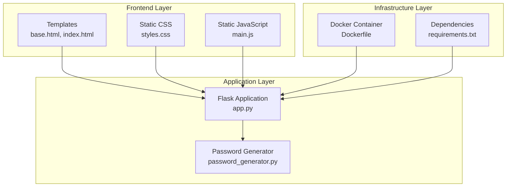
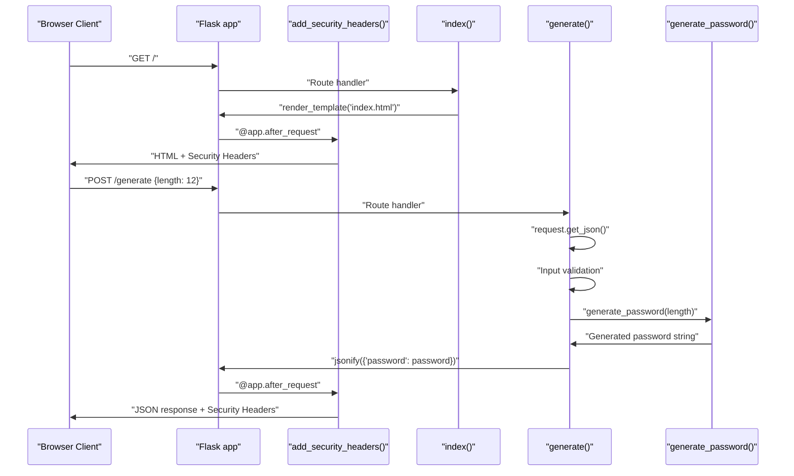
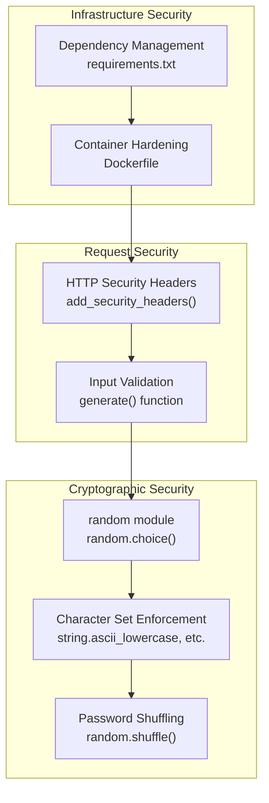

# Password Generator Web Application

A modern, secure password generator with an intuitive user interface.

## Features

- Generate strong passwords with customizable options
- Real-time password length adjustment
- Copy to clipboard functionality
- Animated UI elements
- Responsive design

## Frontend Technologies

- HTML5
- CSS3 with Tailwind CSS
- Vanilla JavaScript
- Modern UI/UX design

## UI Components

### Password Generation Section
- Password display field
- Length slider (4-32 characters)
- Generate button with animated wand icon
- Copy button with animated copy icon

### Password Options
- Uppercase letters toggle
- Lowercase letters toggle
- Numbers toggle
- Symbols toggle

## Getting Started

1. Clone the repository
```bash
git clone https://github.com/jason21333/secure-password-generator.git
```

2. Install dependencies
```bash
pip install flask
```

3. Run the application
```bash
python app.py
```

4. Open your browser and navigate to `http://127.0.0.1:5000`

## UI Features

### Password Length Slider
- Interactive slider for password length
- Real-time length value display
- Range: 4-32 characters

### Generate Button
- Animated wand icon
- Hover effects
- Click animation

### Copy Button
- Animated copy icon
- Visual feedback on copy
- Smooth transitions

### Password Options
- Checkbox toggles
- Custom styled checkboxes
- Clear visual feedback

## Styling

The application uses Tailwind CSS for styling with custom animations:
- Dark theme
- Modern button designs
- Smooth transitions
- Responsive layout
- Custom range input styling

## Browser Support

- Chrome (recommended)
- Firefox
- Safari
- Edge

## Contributing

Feel free to submit issues and enhancement requests!

## Project Structure

```
password-generator-web
├── static
│   ├── css
│   │   └── styles.css       # CSS styles for the web application
│   └── js
│       └── main.js          # JavaScript for handling user interactions
├── templates
│   ├── base.html            # Base HTML template
│   └── index.html           # Main HTML template for password generation
├── app.py                   # Main entry point of the web application
├── pass.py                  # Password generation logic
├── requirements.txt         # Python dependencies
└── README.md                # Project documentation
```

## Setup Instructions

1. Clone the repository:
   ```
   git clone <repository-url>
   cd password-generator-web
   ```

2. Install the required dependencies:
   ```
   pip install -r requirements.txt
   ```

3. Run the application:
   ```
   python app.py
   ```

4. Open your web browser and navigate to `http://127.0.0.1:5000` to access the password generator.

## Usage

- Enter the desired password length and criteria in the form provided on the main page.
- Click the "Generate Password" button to create a secure password.
- The generated password will be displayed on the page.

## License

This project is licensed under the MIT License.

## System Architecture

The application follows a traditional three-tier web architecture with clear separation between presentation, application logic, and supporting infrastructure.



## Request Flow Architecture

The following diagram shows the complete request lifecycle:



## Security Architecture

The application implements security at multiple layers:



### Security Implementation Details

1. **Cryptographic Security**: 
   - Uses Python's `secrets` module for cryptographic operations
   - Guarantees character set inclusion through the `generate_password()` function
   - Random character distribution

2. **Web Security Headers**: 
   - Implemented via `add_security_headers()` decorator
   - X-Content-Type-Options: nosniff
   - X-Frame-Options: DENY
   - X-XSS-Protection: 1; mode=block
   - Content-Security-Policy: default-src 'self'

3. **Input Validation**: 
   - Length constraints (4-128 characters) enforced in the `/generate` route
   - JSON validation and error handling
